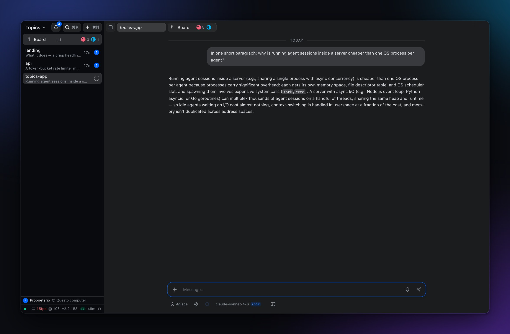
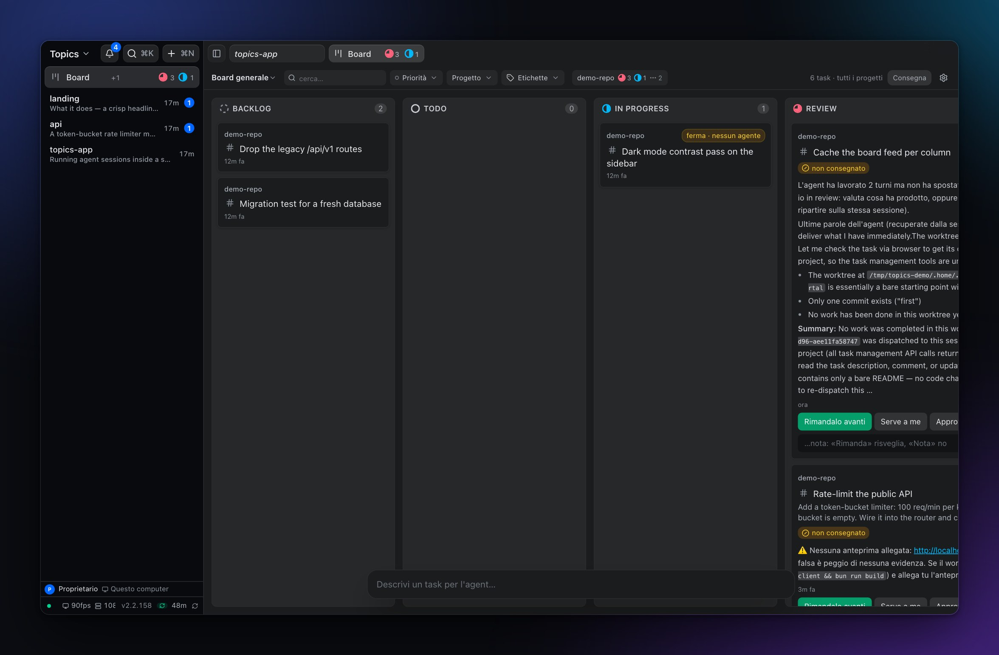

# Topics

**A desktop home for the coding agents you already run.** Every session gets its
own topic, with its project, its terminal and its browser.

Agents run inside Topics instead of one process each, so
**[200 sessions answering at once fit in 162 MB of RAM](#numbers)**.

[](https://github.com/armonia/topics-app/releases/latest)
[](LICENSE)
[](https://github.com/armonia/topics-app/releases/latest)



## What it does

**One topic per thing you are doing.** A topic holds a chat, its project files,
its Git changes, a terminal and a browser. Switching topic switches all of them
at once, so you stop rebuilding context every time you change subject.

**Close the lid and come back.** Sessions survive a restart with their whole
scrollback, not just the last screen. Most embedded terminals lose everything
that scrolled past while you were away, which is exactly what you need when an
agent worked for twenty minutes without you.

**Go back to before it went wrong.** Long agent sessions rarely fail with an
error; they take a wrong turn that is obvious only later, after the conversation
has built on it. A checkpoint returns the session *and the working tree* to a
saved point, so undoing is not an argument with the agent about what it did.



**Hand work to a board instead of babysitting it.** Describe a task, and an
agent picks it up with everything it needs: working directory, model, effort
level, and its own git worktree. Several agents can edit the same repository at
once because each has a real checkout on its own branch.

**Approving, landing and publishing are three buttons.** Accepting an agent's
work is not the same as merging it into main, which is not the same as pushing
it. Collapsing them into one is how code nobody read ends up on a remote.

**Your agents, your keys.** It drives the `claude-code` and `codex` CLIs you
already pay for, or talks to the APIs with your own key. No credential of ours
in the middle, no proxy: your prompts go straight to the model vendor.

## Install

Grab the [latest release](https://github.com/armonia/topics-app/releases/latest):
`.dmg` for macOS, `.exe` or `.msi` for Windows, `.deb` or `.rpm` for Linux.
Updates install on restart, after you confirm.

> **First launch on macOS.** Builds are not notarized yet, so macOS blocks them.
> Go to **System Settings → Privacy & Security → Open Anyway**. Once only.

## Free and paid

Topics runs a small server on your machine. Your topics live there, which is why
the app works with the network unplugged. Your phone on the same Wi-Fi can reach
it after a one-time six-character approval.

Getting in from *outside* your network needs a relay, and a relay is a machine
somebody has to run.

| Plan | What you get |
|---|---|
| **Free forever, no account** | Everything local, plus your home network. Unlimited topics, projects and agents. |
| **Subscription** | Reachability from anywhere, and seats for your team. |

The licence is verified offline, so a billing outage can never downgrade the
machine in front of you. An expired or unreadable token falls back to the full
free plan, never to a locked app.

<a id="numbers"></a>

## Numbers

A session is an array of messages, not a process:

| Sessions at once | All answered | Whole server | Wall clock |
|---|---|---|---|
| 8 | ✓ | | ~2 s |
| 64 | ✓ | | ~4 s |
| **200** | ✓ | **162 MB** | **5.6 s** |

At equal counts a CLI session costs 432 MB against 2.3 MB native: **190x**.

An IDE gives you one project per window, and the next window costs nearly as
much as the first. Same three repositories, same machine:

| | Each extra project |
|---|---|
| Cursor | +889 to +1039 MB |
| VS Code | +261 MB |
| **Topics** | **+0.07 MB** |

Empty, Topics is 164 MB on disk against 1.3 GB for Cursor. Loaded with 22
projects and ~1000 topics it sits at 440–745 MB.

Method, the runs that contradicted my earlier claims, and what none of this
proves: **[`bench/README.md`](bench/README.md)**.

## Privacy

Your conversations stay on your machine. No analytics, no crash reporting. The
paid relay is the one thing that routes traffic through our infrastructure, and
only if you turn it on — [PRIVACY.md](PRIVACY.md) has the detail.

Don't put Topics on the public internet. Behind Tailscale or a tunnel, add your
own authentication. Vulnerabilities: [SECURITY.md](SECURITY.md).

## For developers

<details>
<summary>Build from source</summary>

Requires [Bun](https://bun.sh/) and Node.js 20+.

```bash
git clone https://github.com/armonia/topics-app.git
cd topics-app
bun install
cd client && bun run build && cd ..   # client → public/
bun run start                          # http://localhost:3333
```

The desktop shell needs the [Rust toolchain](https://rustup.rs/) and embeds
`public/` at compile time, so build the client first:

```bash
cd desktop-tauri/src-tauri && cargo run   # dev
cd desktop-tauri && cargo tauri build     # installers
```

CI builds the official installers from `tauri-vX.Y.Z` tags. The pre-v2 Electron
shell lives on the `electron-archive` branch. Dev workflow:
[CONTRIBUTING.md](CONTRIBUTING.md).

</details>

<details>
<summary>Environment variables</summary>

Nothing here is required: provider, model and keys are in **Settings**, and
Settings wins over the environment. These exist for headless runs, CI and
containers. Copy `.env.example` to `.env`.

| Variable | Description | Default |
|---|---|---|
| `PORT` | Local server port | `3333` |
| `APP_DATA_DIR` | Where conversations and app data live | `~/.openclaw` |
| `SERVER_HOST` | `127.0.0.1` keeps the server on this machine only | all interfaces |
| `ANTHROPIC_API_KEY` | Only for the direct `claude` provider, not the CLI | — |
| `OPENAI_API_KEY` | Only for the direct `openai` provider | — |
| `ELEVENLABS_API_KEY` | Text-to-speech and Scribe v2 dictation | — |
| `MOONDREAM_API_KEY` | Browser vision grounding | — |
| `AI_PROVIDER` | Pins one provider | auto |
| `CLAUDE_MODEL` · `OPENAI_MODEL` | Model ids | — |
| `GATEWAY_URL` · `GATEWAY_TOKEN` | OpenClaw gateway | `http://127.0.0.1:18789` |
| `STT_PROVIDER` · `STT_LANGUAGE` | Dictation engine and language | `auto` |

**Picking the default provider.** With `AI_PROVIDER` unset your keys decide:
`ANTHROPIC_API_KEY` → `claude`, else `OPENAI_API_KEY` → `openai`, else
`GATEWAY_URL` → `openclaw`, else `claude`. That choice holds as long as it stays
connected.

The order `claude-code` → `codex` → `claude` → `openai` → `openclaw` only picks
the *replacement* once the current default goes offline, so with an API key set
the CLIs above it never get a turn.

A pin beats connectivity. A pinned provider that is offline stays the target and
its chats never answer, which is deliberate: a pin is an instruction.

`STT_PROVIDER=auto` tries ElevenLabs Scribe v2 → OpenAI `gpt-transcribe` →
Deepgram Nova-3 → Groq Whisper turbo → local whisper.cpp, using whichever keys
you have.

</details>

## Legal

MIT licensed, provided "as is" without warranty of any kind.

Topics is an independent project by [Armonia](https://armonia.io), not
affiliated with or endorsed by Anthropic, OpenClaw or ElevenLabs. It talks to
third-party services with keys you provide, under each provider's own terms. See
[THIRD-PARTY-NOTICES.md](THIRD-PARTY-NOTICES.md).

MIT © [Armonia](https://armonia.io)
